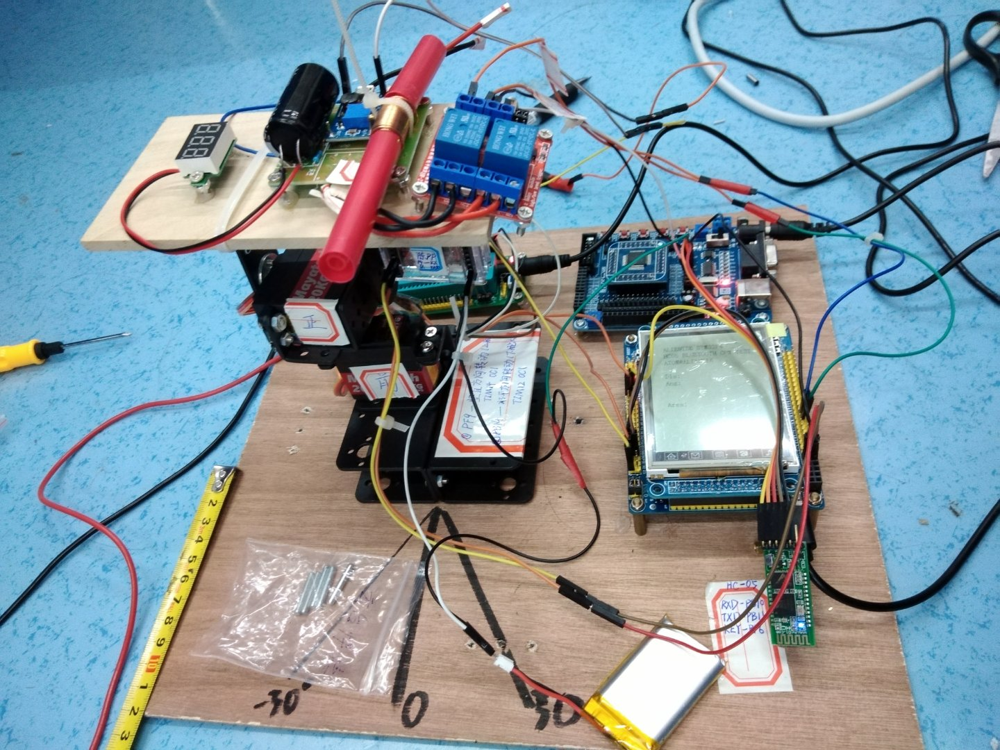

# 2019电赛H题  电磁炮

[博客](http://www.dccun.xyz/2019/08/07/2019%E7%94%B5%E5%AD%90%E7%AB%9E%E8%B5%9B%E5%9B%BD%E8%B5%9B/#more)

开发板：stm32f407核心板

器件清单：openmv3、舵机2个、云台。

1、电磁炮的炮管放在二维云台上控制电磁炮水平垂直运动，通过控制继电器高低电平控制充电时间，通过控制舵机旋转控制炮管角度，进而控制炮弹发射距离和方向。

2、按键模块使用的是手机APP，通过蓝牙模块HC-5向开发板（stm32F407核心板）传输发射距离和角度。

3、发挥部分的自动寻靶和测距用的是openmv，这些都能在openmv官网找到代码，openmv找到靶子并且测得距离后通过串口发送给开发板，继而控制舵机，然后发射炮弹。
